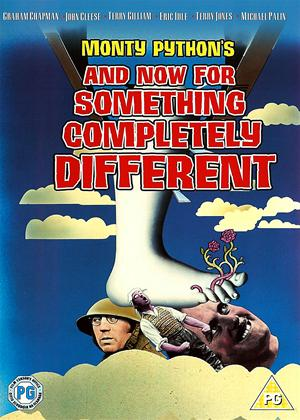
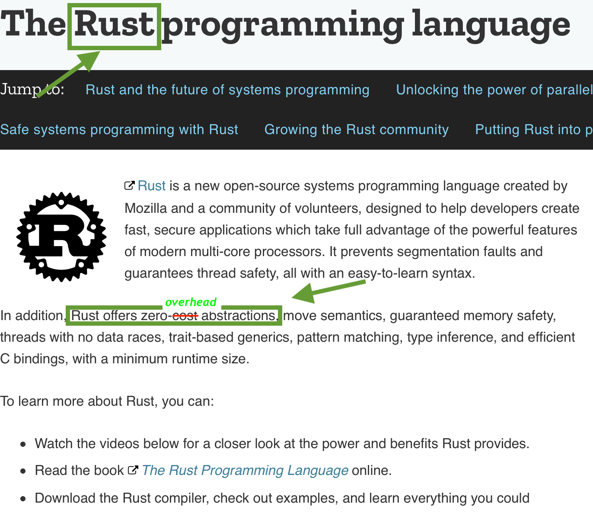

#the Cost of Abstractions

#### Massimiliano Mantione
#### Gianluca Carucci

---
<br>
#once upon a time...


^
this story starts with me and Massi take the train from milan to Lecco reaching our Hyperfair office.
Often I tell to Massi about my journey in functional programming structure like Monad, ADT and so on... and how them helps me to make my code more readable checked and powerfull.

---

<br>
#What is the Cost of Abstractions? 
 


^
The strange thing is all trip ends in the same way, with Massi that ask me "Cool, but what about the cost of those abstractions?"
My answer is always the same....

---


^
ehm... I dont know, but it's the perfect moment to have a talk together about this topic!

---

[slide presentazione massi]

---

[slide presentazione gianluca]

---
<br>
#what **cost** means?


^
domanda al pubblico...

---

<br>
#it's not all about performances


---
###typescript

```javascript
const processor: AsyncProcessor = async (
  orderId: string
): Promise<PlacedOrderResult> => {
  const order = await orderService(orderId)
  if (order == null) {
    return {
      success: false
    }
  }
  const validationResult = await validationService(order)
  if (!validationResult.valid) {
    return placedOrderFailed
  }
  return await placeOrderService(order)
}
```
---
### javascript

```javascript
const processor = async (orderId) => {
  const order = await orderService(orderId)
  if (order == null) {
    return {
      success: false
    }
  }
  const validationResult = await validationService(order)
  if (!validationResult.valid) {
    return placedOrderFailed
  }
  return await placeOrderService(order)
}
```
---


## typescript

- **no performace penalty**

---

## typescript

- no performace penalty
- **cognitive overhead**

---

##performaces matter
#### let's go to measure 


---


###"buy a book" use case
- **create an order of books**


---

###"buy a book" use case
- create an order of books
- **validate the order**


---

###"buy a book" use case
- create an order of books
- validate the order
- **place the order**


---
##benchmark

- **"buy a book" use case**


---
##benchmark

- "buy a book" use case
- **[xxx] iterations**


---
##benchmark

- "buy a book" use case
- [xxx] iterations
- **[yyy]% of failure orders**


---

[slide with qr code where download slides&code]

---

#ready 
#steady 
#go!


---

###async typescript

```javascript
  const order = await orderService(orderId)
  if (order == null) {
    return {
      success: false
    }
  }
  const validationResult = await validationService(order)
  if (!validationResult.valid) {
    return placedOrderFailed
  }
  return await placeOrderService(order)
```

---
#next step
####**add** an abstraction layer (fp-ts)


^
we add an abstraction layer using fp-ts in order to make code readable and simplify (task) composition

---

###functional javascript

```javascript
  return pipe(
    orderService(orderId),
    chain(validationService),
    chain(placeOrderService)
  )
```
---
#RESULTS
**async typescript 20s**


---
#RESULTS
async typescript 20s
**functional typescript 12s**


---
<br>
#sounds strange


---
#RESULTS
async typescript 20s
functional typescript 12s


---

#RESULTS
**async target es3 typescript 20s**
functional typescript 12s


---

#RESULTS
async target es3 typescript 20s
**async target es6 typescript 5s**
functional typescript 12s


---


---

- **same code could have (huge) different perfomance**


---

- same code could have (huge) different perfomance
- **check default compiler options**


---
#next step
#### **enforce** business rules at compile time


---

###checked functional javascript

```javascript
type NotValid = Left<Error>
type Valid<A> = Right<A>
type Validated<A> = Either<Error, A>

function validationService (o: Order): Validated<Order>  {
  const r = validateOrder(order)
  if (r.valid) {
    return valid<Order>(order)
  } else {
    return notvalid(`${r.error}`)
  }
}


```

---

###checked functional javascript

```javascript

function calculateAmountService (order: Valid<Order>) {
  return pipe(
    order.right.items.map(item =>
      pipe(
        bookService(item.bookId),
        map(b => b.price * item.quantity)
      )
    ),
    array.sequence(taskEither),
    map(amounts => {
      return amounts.reduce((a, b) => a + b, 0)
    })
  )
}
function placeOrderService (order: Valid<Order>) {
  return pipe(
    calculateAmountService(order),
    map(placedOrderSuccess)
  )
}

```
---

###checked functional javascript

```javascript

  return pipe(
    orderId,
    orderService,
    map(validationService),
    chain(mapTask(placeOrderService))
  )
```
---

#RESULTS
async target es3 typescript 20s
async target es6 typescript 5s
functional typescript 12s


---

#RESULTS
async target es3 typescript 20s
async target es6 typescript 5s
functional typescript 12s
**checked functional typescript 12.1s**


---

#RESULTS
- no performance penalty
- cognitive overhead


---

###how can achive 
###the best of 
###the two world?


^
performance and maintenability

---



---

#next step
#### **change** langauge


---



---

[TBD]

---

[TBD]

---

#RESULT
async target es3 typescript 20s
async target es6 typescript 5s
functional typescript 12s
checked functional typescript 12.1s


---

#RESULT
async target es3 typescript 20s
async target es6 typescript 5s
functional typescript 12s
checked functional typescript 12.1s
**rust native [x]s**


---
<br>
#what about the web?


^
what about the web? are we forced to pay for abstraction?

---

#next step
#### **move** to WebAssembly using the same cost 


---
#RESULT
async target es3 typescript 20s
async target es6 typescript 5s
functional typescript 12s
checked functional typescript 12.1s
rust native [x]s


---

#RESULT
async target es3 typescript 20s
async target es6 typescript 5s
functional typescript 12s
checked functional typescript 12.1s
rust native [x]s
**rust wasm [y]s**


---

[vogliamo software migliore]

---

[ma cosa significa migliore?]

---

[profit = revenue * time_to_market - cost
time to market: [0...1]

migliore profit massimo]

---

[come lo massimiziamo?]


---

[performance vs mantenibilità]

---

[possiamo ottenere entrambe?]

---

[no perchè ogni astrazione incide positivamente o sulle performance o sulla mantenibilità, non su entrambe]

---

#one more thing
[come incide l'overhead cognitivo?[

---

