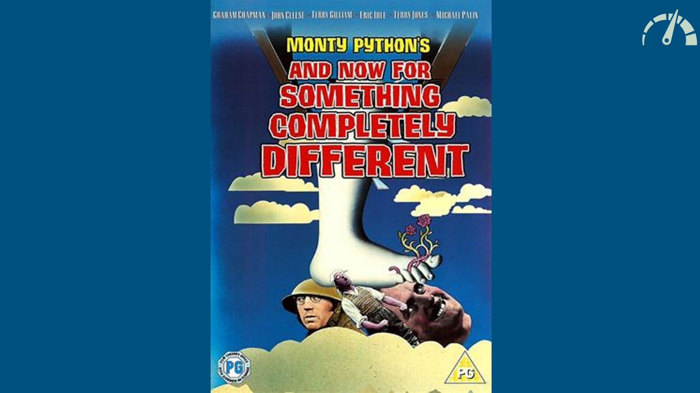

---
<br>
#once upon a time...


^
This story starts with me and Massi traveling by train from Milan to Lecco to reach our Hyperfair office.
Often I tell Massi about my adventures in functional programming structures like Monad, ADT and so on... and how them help me making my code more readable, safe and powerful.

---

<br>
#What is the Cost of Abstractions? 
 


^
The strange thing is every trip ends in the same way, with Massi asking me "Cool, but what about the cost of those abstractions?"
My answer is always the same....

---


^
ehm... I dont know, but it's the perfect moment to have a talk together about this topic!


---


---


---


---
<br>
#what does **cost** mean?


^
domanda al pubblico...

---

<br>
#it's not all about performance


---
### javascript

```javascript
const processor = async (orderId) => {
  const order = await orderService(orderId)
  if (order == null) {
    return {
      success: false
    }
  }
  const validationResult = await validationService(order)
  if (!validationResult.valid) {
    return placedOrderFailed
  }
  return await placeOrderService(order)
}
```


---

###typescript

```javascript
const processor: AsyncProcessor = async (
  orderId: string
): Promise<PlacedOrderResult> => {
  const order = await orderService(orderId)
  if (order == null) {
    return {
      success: false
    }
  }
  const validationResult = await validationService(order)
  if (!validationResult.valid) {
    return placedOrderFailed
  }
  return await placeOrderService(order)
}
```


---


## typescript

- **no performace penalty**


---

## typescript

- no performace penalty
- **cognitive overhead**


---

##performace matters
#### let's measure 


---


###"buy a book" use case
- **create an order of books**


---

###"buy a book" use case
- create an order of books
- **validate the order**


---

###"buy a book" use case
- create an order of books
- validate the order
- **place the order**


---
##benchmark

- **"buy a book" use case**


---
##benchmark

- "buy a book" use case
- **500k different orders**


---
##benchmark

- "buy a book" use case
- 500k different orders
- **5% failure rate**


---
##benchmark

- "buy a book" use case
- 500k different orders
- 5% failure rate
- **measure mean order time**


---


---

#ready 
#steady 
#go!


---

###async typescript

```javascript
  const order = await orderService(orderId)
  if (order == null) {
    return {
      success: false
    }
  }
  const validationResult = await validationService(order)
  if (!validationResult.valid) {
    return placedOrderFailed
  }
  return await placeOrderService(order)
```


---

#RESULTS
...


---

#RESULTS
**async typescript 6.772μs**


---

#next step
####**add** an abstraction layer (fp-ts)


^
we add an abstraction layer using fp-ts in order to make the code more readable and to simplify (task) composition

---

###functional javascript

```javascript
  return pipe(
    orderService(orderId),
    chain(validationService),
    chain(placeOrderService)
  )
```


---
#RESULTS
async typescript 6.772μs


---
#RESULTS
async typescript 6.772μs
**functional typescript 5.952μs**


---
<br>
#this sounds strange


---
#RESULTS
async typescript 6.772μs
functional typescript 5.952μs


---

#RESULTS
**async typescript(_target es3_) 6.772μs**
functional typescript(_target es3_) 5.952μs


---

#RESULTS
async typescript(_target es3_) 6.772μs
**async typescript(_target es2018_) 2.004μs**
functional typescript(_target es3_) 5.952μs
**functional typescript(_target es2018_) 5.636μs**


---


---

- **the same code can run with (hugely) different perfomance**


---

- the same code can run with (hugely) different perfomance
- **check default compiler options**


---
#next step
#### **enforce** business rules at compile time


---

###checked functional javascript

```javascript
type NotValid = Left<Error>
type Valid<A> = Right<A>
type Validated<A> = Either<Error, A>

function validationService (o: Order): Validated<Order>  {
  const r = validateOrder(order)
  if (r.valid) {
    return valid<Order>(order)
  } else {
    return notvalid(`${r.error}`)
  }
}


```


---

###checked functional javascript

```javascript

function calculateAmountService (order: Valid<Order>) {
  return pipe(
    order.right.items.map(item =>
      pipe(
        bookService(item.bookId),
        map(b => b.price * item.quantity)
      )
    ),
    array.sequence(taskEither),
    map(amounts => {
      return amounts.reduce((a, b) => a + b, 0)
    })
  )
}


```


---

###checked functional javascript

```javascript

  return pipe(
    orderId,
    orderService,
    map(validationService),
    chain(mapTask(placeOrderService))
  )
```


---

#RESULTS
async typescript 2.004μs
functional typescript 5.636μs


---

#RESULTS
async typescript 2.004μs
functional typescript 5.636μs
**checked functional typescript 5.402μs**


---

#RESULTS
Show typescript-simple.png


---

#RESULTS
- no performance penalty
- slightly *faster* (one less `chain`?)
- cognitive overhead


---

###can we have 
###the best of 
###both worlds?


^
performance and maintenability

---



---

#next step
#### a **different** language


---


---

# What does *zero cost* mean?
- *zero cost* for the abstractions you *do not use*
- what you *do* use, cannot be done *any better*
- this means "zero *runtime overhead*"
- you will pay a *build time* cost 
- plus cognitive overhead...


---

# A Rust implementation
- faithful to the Typescript one
- line by line adaptation
- let's benchmark!


---

#RESULTS
async typescript 2.004μs


---

#RESULTS
async typescript 2.004μs
**what do you expect?**


---

#RESULTS
async typescript 2.004μs
**async rust (native) 0.2410μs**


---

#RESULTS
async typescript 2.004μs
async rust (native) 0.2410μs
**and 8x speedup?**


---

# WAT?
does this make sense?
is it a fair comparison?
let's investigate
we start from scratch
with a synchronous typescript version


---

# Start from Scratch
from *synchronous* typescript version
then we add minimal abstractions
one by one
and benchmark each step


---

#RESULTS
Show typescript-full.png
(briefly describe each abstraction step)


---

#What Happened?
plain Typescript is *fast*
abstractions built on it are *slow*
the nodejs event loop does *not* help much
let's do the same with Rust...


---

#RESULTS
Show typescript-rust.png


---
<br>
#what about the web?


^
what about the web? are we *forced* to pay for abstractions?

---

#next step
#### same Rust code running on **WebAssembly** 


---
#RESULTS
Show typescript-wasm.png


---


---

- **we're focusing on better software**


---

- we're focusing on better software
- **but what does "better" software mean?**


---

$$profit(t) = (revenue(t)*time2market)-cost(t), 
\quad\quad \text{[$0>=time2market<=1$]}$$


---

- we're focusing on better software
- but what does "better" software mean?
- **$$"better" = max(profit(t))$$**


---

- we're focusing on better software
- but what does "better" software mean?
- $$"better" = max(profit(t))$$
- **how do we do that?**


---

performance 
_vs_
maintainability


---

#design abstraction
- :-1: performance 
- :+1: maintainability


---

#code optimisation abstraction
- :+1: performance 
- :-1: maintainability


---

#but...


---

###can we achieve **both** performance and maintainability?


---

###**rust** is the answer!
####zero ~~cost~~ overhead abstraction


---

#but...


---

###what about **cognitive overhead**?


---
#summary
- costs have different shapes
- abstractions have different shapes
- design decisions **involve** a costs
- there are **no** zero cost abstractions, but...
- ...we can choose **where** to incur costs
- choose abstractions depending on the **context**


---


---

##questions?


---


